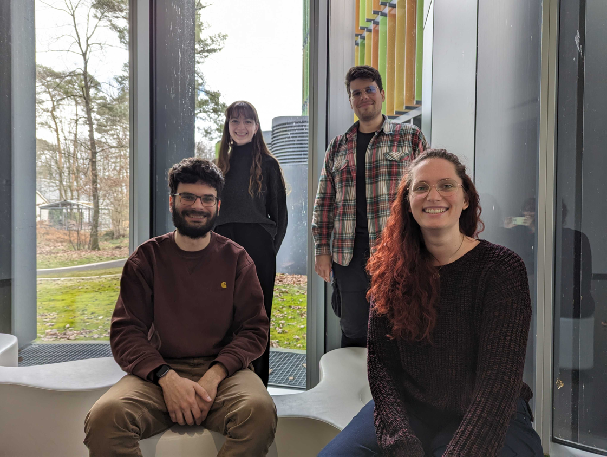

\
**Revolutionizing Healthcare through Immunomics**

The past century has witnessed remarkable advancements in medicine, significantly extending lifespans and improving quality of life. Breakthroughs in basic biology and pharmacology, such as the development of antibiotics and vaccines, have revolutionized our approach to infectious diseases. However, as non-communicable diseases now pose the greatest health threat, a new paradigm is needed.

**Precision Medicine: A Systems Biology Approach**

Complex diseases are influenced by a multitude of factors, including genetics, environment, and lifestyle. To address these challenges, our research group employs a systems biology approach to molecular and translational immunomics. By integrating high-resolution, high-throughput technologies like single-cell RNA sequencing with advanced computational methods, including artificial intelligence, we aim to unravel the intricate mechanisms underlying immune function and dysfunction.

**Our Research Focus**

We are particularly interested in understanding how environmental factors, such as diet and pollution, impact the immune system's ability to respond to challenges. By studying model systems like tonsil organoids and leveraging computational tools, we seek to uncover the molecular determinants of immune fitness and vaccination efficacy.

Our research team combines biological expertise with advanced technological approaches to address critical scientific questions. We are dedicated to developing innovative analytical methods and workflows to enhance our understanding of complex biological systems.

Ultimately, our goal is to develop precision medicine strategies that can tailor treatments to individual patients, leading to more effective and personalized healthcare.

\

