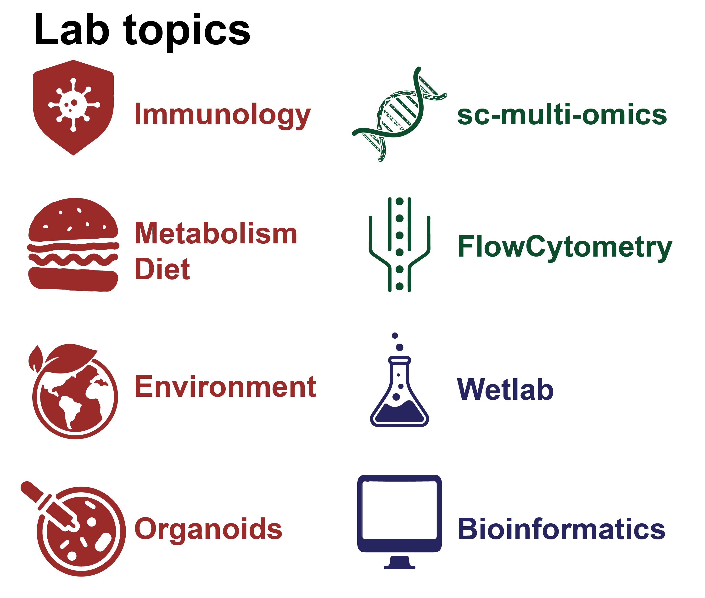

# Molecular and Translational Immunomics

Our research group in **molecular and translational immunomics** uses a systems-level omics approach to understand how the immune system functions in health and disease. We integrate classical hypothesis-driven research with high-resolution, high-throughput technologies, such as single-cell RNA sequencing, and advanced analytical methods, including artificial intelligence approaches. 
Specifically, we are interested in how environmental exposures like diet and pollution affect the immune system's ability to respond to challenges. We investigate the exposome's influence on immune response and vaccination efficacy using model systems like tonsil organoids and computational tools to decipher the molecular mechanisms that govern immune fitness.

## Our aim
Over the last 100 years, quality of life and expectancy have drastically improved due to massive advancements in medical fields. These developments were going hand-in-hand with groundbreaking research in basic biology and pharmacology. For example, the discovery and development of antibiotics and the design of several vaccination strategies have revolutionized the way we deal with infections. In the 21st century, when, in non-pandemic situations, the highest causes of death are non-communicable diseases, we need to define new strategies to tackle and eradicate those diseases. These diseases are complex and are based on the individual predisposition of the patient and their clinical history. The combination of high-dimensionality methodologies for deep patient profiling is the only strategy to develop a precision medicine approach to find a successful treatment for these diseases. Compared to a more traditional approach, system-level immunomics research requires a highly interdisciplinary team and a collaborative effort to reach the critical mass of data necessary to understand complex diseases, which are the ideas and fundamentals of my scientific approach.
