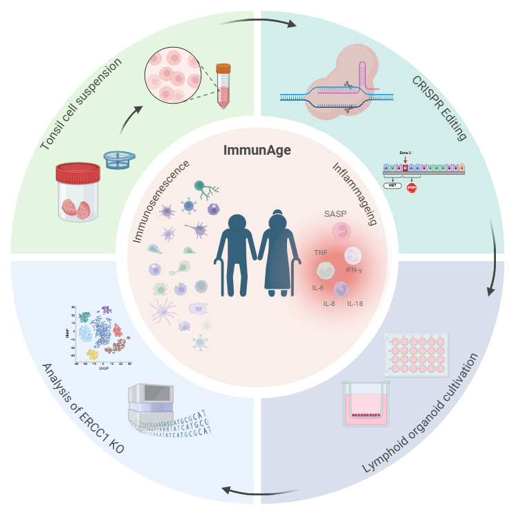
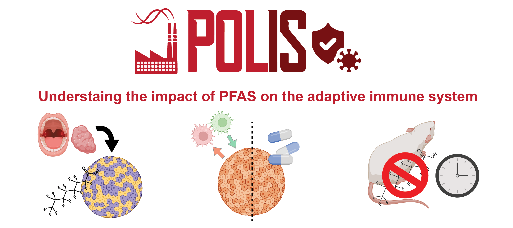

## ImmuDiet

\
In ImmuDiet we aim to bridge the gap in knowledge regarding the effects of dietary intervention on circulating immune cells in humans with an emphasis on individuals at risk to develop NCDs related to overweight, obesity and/or metabolic syndrome. Important research in murine models showed clear evidence for a strong dependency between diet and composition/fitness of the immune system. We, therefore, hypothesize that changes in diet, particularly from Western-style diets to Vegetarian or Nordic diets over a certain period of time will lead to reduced inflammatory tonus or a reduced low-grade chronic inflammation that can be determined by scRNAseq in circulating immune cells. In this respect, highly controlled longitudinal dietary intervention studies are an ideal setting to study the effects induced by dietary changes on the human immune system. Here, we intend to investigate the transcriptional changes at single cell level in peripheral blood in both homeostatic conditions and after ex vivo LPS challenge as a surrogate for immune cell activation. To address the hypothesis, together with colleagues of the department of nutritional and food science, we already conducted a cohort study of male individuals, overweight and with several risk factors for cardiovascular and neurodegenerative diseases and propose here to generate and analyse scRNAseq data. We postulate that the high-dimension, high-resolution data derived from scRNAseq will give a picture of unprecedented resolution about the changes that occur within the immune system because of dietary changes. Despite the high dimensionality of the data, the complexity of the composition of each diet will make it difficult to directly build a relationship between single components and the impact on the immune system. we will therefore complement the information derived from the scRNAseq analysis with in vitro experiments where the most likely dietary components will be tested on PBMCs derived from the same participants in the dietary intervention study to link specific components to the observed phenotype. We am confident that this in depth analysis will open new avenues for tailored interventions in individuals at elevated risks for developing NCDs due to chronic low-grade inflammatory immune reactions induced by current dietary habits in our societies. 

**ImmuDiet** is a *Deutsche Forschungsgemeinschaft* (DFG) funded project

\

## ImmunAge

\
Aging significantly impacts the immune system, leading to various challenges in maintaining effective immune responses. An aged immune system is marked by various functional declines, including impaired capacity to fight infections, reduced response to vaccinations and increased risk of age-related diseases. On a cellular level, immune aging is characterized by cell type-specific dysfunctions: antigen-presenting cells show reduced antigen processing and presentation, B cells produce fewer and lower-quality antibodies, and T cells increasingly adopt a memory phenotype, with a corresponding reduction in TCR diversity and antigen recognition range. Alongside cellular senescence, aging is often accompanied by uncontrolled, low-grade inflammation—referred to as "inflammageing."

The ImmunAge project aims to uncover the molecular mechanisms driving immunosenescence and inflammageing by generating an in vitro model using lymphoid organoids. By CRISPR-Cas9 to perturbation of the ERCC1 gene (Yousefzadeh et al., Nature 2021), we will create a model for immunosenescence. To explore the suitability of this model, we will utilize single-cell multiomic approaches, providing high-resolution insights into cellular and molecular determinants associated with immune aging.

**ImmunAge** is a *ImmunoSensation2* funded project

\

## POLIS

\
There is growing evidence that currently used toxicological assessments of chemicals fail to fully capture their actual biological activity. While chemicals are routinely tested for acute toxic effects, often at high concentrations, potential function-modulating effects at low concentrations are often underexplored. The inclusion of up-to-date high-resolution methods in the toxicological screening praxis would allow instead to fully capture the complex bioactivity profile of these compounds, which depends on numerous aspects including bioavailability, route of exposure and individual susceptibility. While the last 100 years have seen an enormous number of chemicals introduced into our daily life, of which a large number are well-known to persist in the environment, a sufficient understanding of their bioactivity potential is lacking. Also based on growing evidence, it is not far-fetched to hypothesize that some of these industrial chemicals could be partly responsible for the constant increase of non-communicable diseases including autoimmune diseases, chronic inflammatory diseases but also cancer or (neuro)degenerative diseases. Perfluoroalkyl and Polyfluoroalkyl Substances (PFAS) are a class of xenobiotics with proven strong toxicity at high-level exposure, while little is known about their bioactivity at concentrations commonly detected in human samples. Considering their high stability and ubiquitous occurrence in the environment and human body, exposure to PFAS has reached a pandemic scale. I postulate that it is of outmost importance to finally dissect the potential of these compounds to molecularly interfere with organ functionalities at the single-cell level using state-of-the-art high-resolution omics technologies. Supported by an interdisciplinary training in pharmacology, systems immunology, omics, animal and cellular models, and bioinformatics, I represent a prime candidate to successfully develop this project and clarify the bioactivity of PFAS.

**POLIS** is an *European Research Council* (ERC) funded project

\

## cyCONDOR

\
High-dimensional cytometry (HDC) is a powerful tool for studying single-cells phenotypes in a complex system. Although in recent years the combination of technological developments and affordability have made HDC broadly available, these technological advances were not paired with the adequate development of analytical methods to take full advantage of the data generated. While several platforms and bioinformatics tools are currently available for the analysis of HDC data, they are either web-hosted with limited scalability or designed for expert computational biologists, making them difficult to approach by wet lab scientists. Additionally, the need for end-to-end HDC data analysis tools within a unified ecosystem poses a significant challenge, as researchers must navigate multiple platforms and software packages to complete the analysis. We developed an easy-to-use computational framework (condor) covering not only all of the essential steps of cytometry data analysis but also including an array of downstream functions and tools to expand the biological interpretation of the data. condor's comprehensive suite of features, including guided pre-processing, clustering, dimensionality reduction, and machine learning algorithms, facilitates the seamless integration of condor into clinically relevant settings, where scalability and disease classification are paramount for the widespread adoption of HDC in clinical practice. Additionally, condor's advanced analytical features, such as pseudotime analysis and batch integration, provide researchers with the tools to extract deeper insights from their data. We used condor on a variety of data from different tissues and technologies demonstrating its versatility to assist the analysis of high dimensionality data from preprocessing to biological interpretation.

[Discover more on GitHub](https://github.com/lorenzobonaguro/cyCONDOR)
