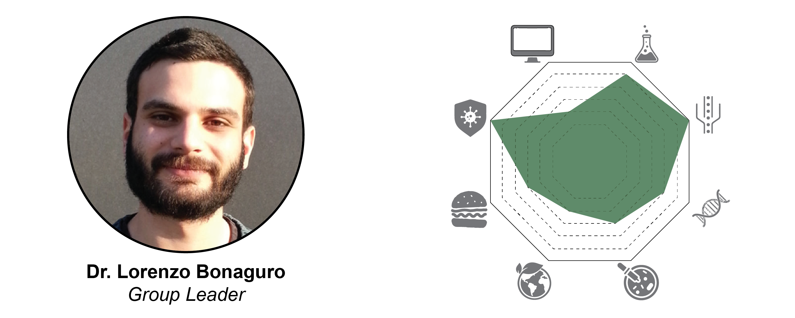
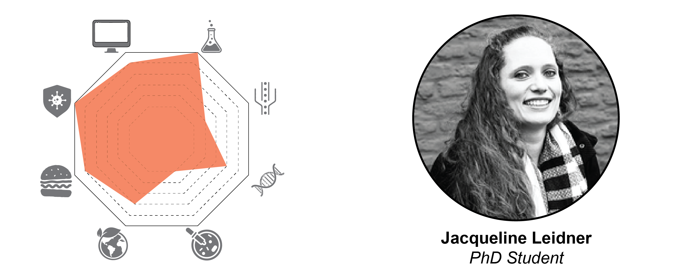
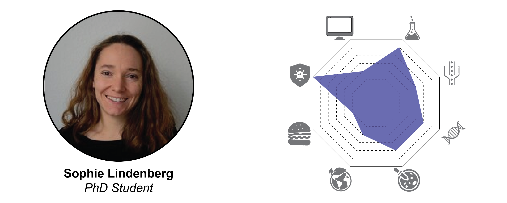
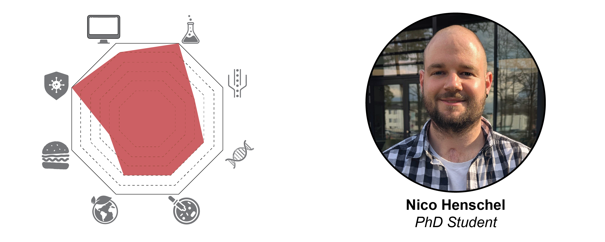
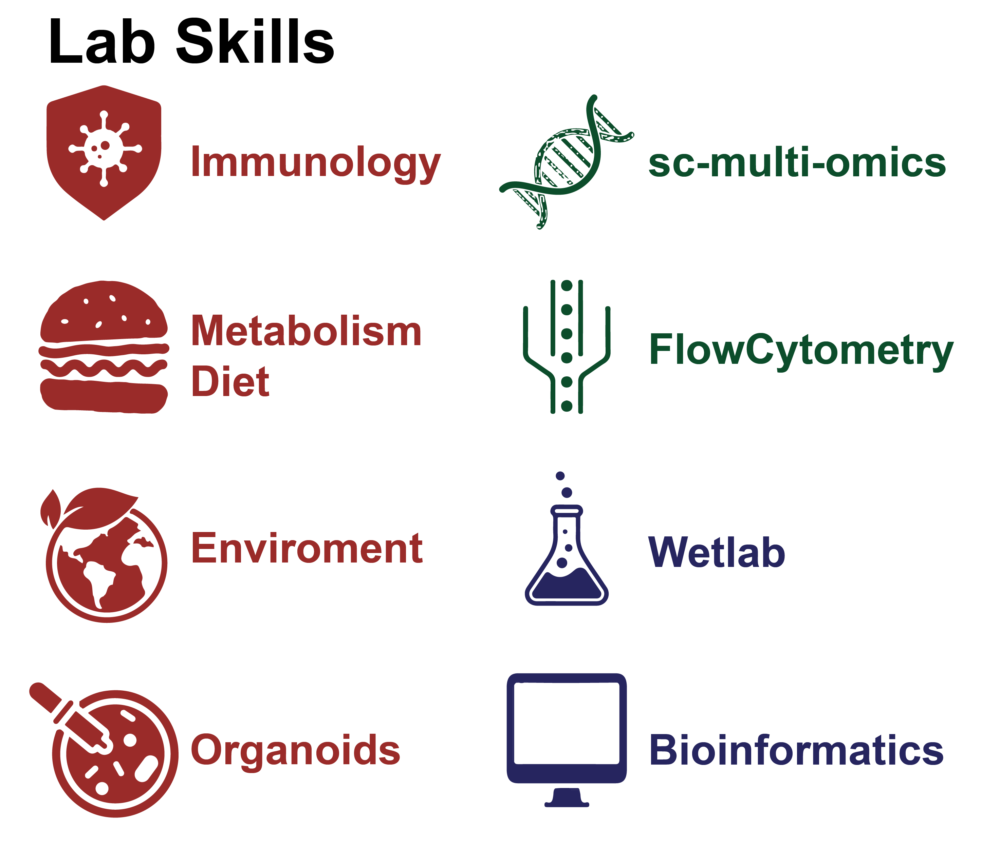

\
\
\

\
In my group in molecular and translational immunomics, I want to take advantage of a system-level omics approach to understand the molecular mechanisms of physio-pathological immunological processes (Bonaguro et al. Nat. Imm, 2022b). As an overarching concept, I combine classical hypothesis-driven research approaches with the concept of utilizing high-resolution, high-content technologies, in combination with state-of-the-art analytical approaches including the most advanced AI approaches. I am particularly interested in the effect of environmental perturbations on the capacity of the immune system to respond to challenges. In this context, I am studying the impact of diet and ageing on the immune system's response to challenges and vaccination. I am doing this by combining clinical cohorts, model systems (tonsil organoids), and computational methods to understand the molecular mechanism underlying immune fitness. 

**contact:** lorenzo.bonaguro(at)dzne.de

\
\
\

\
As a trained biologist I strive to get a better understanding of the mechanisms underlying the functionality of the human body and its interaction with the environment. Within my PhD project ImmuDiet I focus my attention on the human immune system and how its reponsiveness is related to changes in nutrition. While having gained experiences in wet lab as well as bioinformatics during my previous studies, I appreciate the opportunity to combine these skill sets using different omic- and analysis approaches. 

\
\
\

\
I am a PhD student working on the ImmunAge project, where I investigate the mechanisms underlying immune aging. My research focuses on understanding the cellular and molecular mechanisms underlying immunosenescence and inflammageing by generating an organoid model system to study an aging immune system. Driven by a deep interest in immunology and the relationship between the immune system and disease, I aim to uncover insights that could guide future strategies for improving immune health in aging populations.

\
\
\

\
As a PhD student working on the POLIS project, I investigate how perfluoroalkyl and polyfluoroalkyl substances (PFAS) affect the immune system. Using human immune organoids in combination with high-resolution single-cell omics technologies, I aim to elucidate how PFAS modulate the function of immune cells and contribute to the development of diseases such as neurodegenerative disorders, autoimmune diseases or cancer. I am particularly fascinated by the complex interactions within and between immune cells and their dynamic interplay with the environment. My work is driven by a strong desire to generate insights that meaningfully advance human health.

\
\
\
