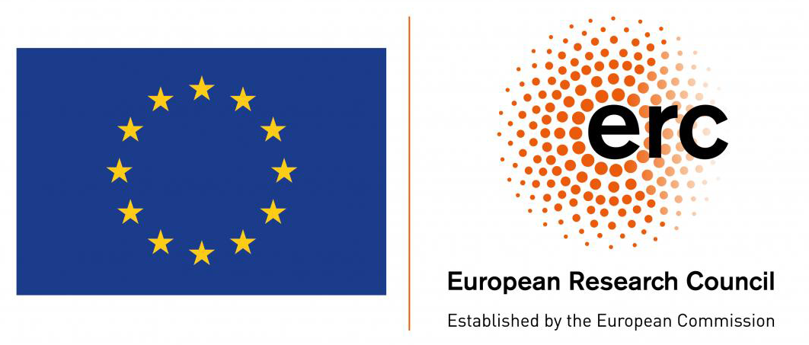

\
The **POLIS** project was awarded an **ERC Starting Grant** (ERC StG). With this funding we will be able to investigate the long-term effect of PFAS exposure on the immune system!

We are greatfull to the European Research Council and all the reviewers for all the support!

Read more [here](https://www.dzne.de/en/im-fokus/meldungen/2024/around-15-million-euros-for-researching-the-effects-of-forever-chemicals-on-the-immune-system/)

